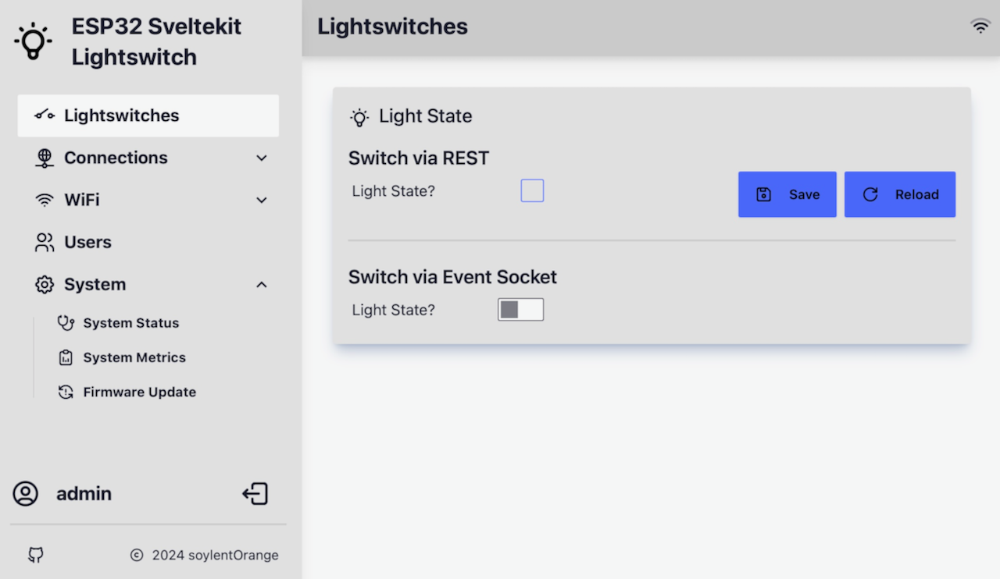

# ESP32 SvelteKit Lightswitch

 

A simple ESP32 based IoT project with a feature-rich, beautiful, and responsive front-end build with [Sveltekit](https://kit.svelte.dev/), [TailwindCSS](https://tailwindcss.com/) and [DaisyUI](https://daisyui.com/). This project was generated from the great [ESP32-sveltekit template](https://github.com/theelims/ESP32-sveltekit) by [elims](https://github.com/theelims).

> **Tip**: This project is just a bare minimum functional example. It is indended as a starting point for further projects in need of a rich web UI.

## Hardware

  

 

Tested on [wemos_d1_mini32 board](https://www.wemos.cc/en/latest/). The board is discontinued by Wemos, but several clones are being offered with very low pricetags.

> **Tip**: The onboard-LED is connected to GPIO-02.

## Visit the ESP32-sveltekit Project Site

See how to get started with your own project at: [https://theelims.github.io/ESP32-sveltekit/](https://theelims.github.io/ESP32-sveltekit/).

## Libraries Used

- [SvelteKit](https://kit.svelte.dev/)
- [Tailwind CSS](https://tailwindcss.com/)
- [DaisyUI](https://daisyui.com/)
- [tabler ICONS](https://tabler-icons.io/)
- [unplugin-icons](https://github.com/antfu/unplugin-icons)
- [svelte-modals](https://svelte-modals.mattjennings.io/)
- [svelte-dnd-list](https://github.com/tarb/svelte-dnd-list)
- [ArduinoJson](https://github.com/bblanchon/ArduinoJson)
- [PsychicHttp](https://github.com/hoeken/PsychicHttp)
- [PsychicMqttClient](https://github.com/theelims/PsychicMqttClient)
- [ESP32-sveltekit](https://theelims.github.io/ESP32-sveltekit)

## Licensing

ESP32 SvelteKit Lightswitch is distributed with two licenses for different sections of the code. The back end code inherits the GNU LESSER GENERAL PUBLIC LICENSE Version 3 and is therefore distributed with said license. The front end code is distributed under the MIT License. See the [LICENSE](LICENSE) for a full text of both licenses.
