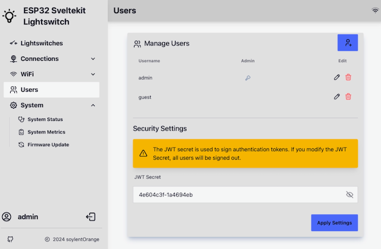

# Factory Settings

The factory default settings, either after flashing the binary to the board for the first time or after applying from the System Status menu are managed in [factory_setting.ini](https://github.com/soylentOrange/esp32-sveltekit/blob/main/factory_settings.ini).

## soft-AP

By default, the soft-AP offers a network with: 

- SSID: ESP32-#{unique_id} 
- password: esp-sveltekit 
- ip-address: 192.168.4.1

## Users

By default, a gueat and an admin user are defined. 
The credentials are simply:

- guest/guest
- admin/admin

The JWT secret used to sign authentication tokens is generated randomly. You can look look it up in the users menu:

 

